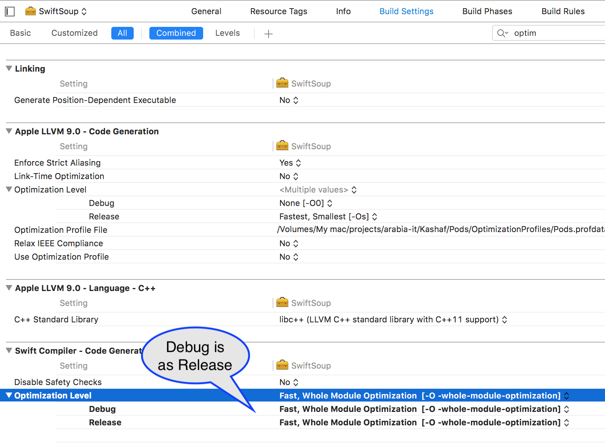

## Background

Compiler optimizations are disabled by default in Debug mode. This is to enable a sane debug experience by avoiding omitted variables (or even whole blocks of code). Such omissions are often done as a part of the optimization phase in a compiler work.

## Problem

Sometimes, we use a dependency (e.g. via CocoaPods) that may perofrm noticebly slower in Debug mode. Since it's a dependency, and as long as it isn't causing problems, we probably are not interested in debugging it. Therefore we can comfortably enable optimizations in Debug mode.



## ⚠️ Not A Lasting Solution ⚠️

This will get reset after the very first `pod install`. To overcome this, add a post-install CocoaPods "hook":

```Ruby
post_install do |installer|
      targetsToOptimizeAtDebug = ['SwiftSoup']
      
      installer.pods_project.targets.each do |target|
          if targetsToOptimizeAtDebug.include? target.name
            target.build_configurations.each do |config|
                if config.name == "Debug"
                    config.build_settings['SWIFT_OPTIMIZATION_LEVEL'] = '-Owholemodule'
                end
            end
          end
      end
  end
```

## That's it! ✅

Now for every relevant pod, you can add it to the array above, and forget.